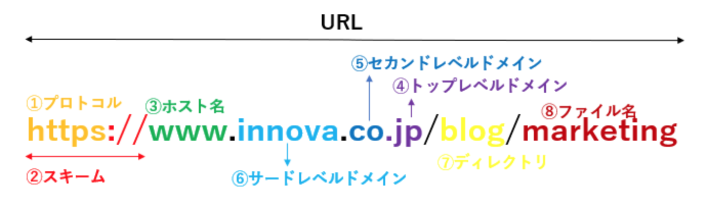
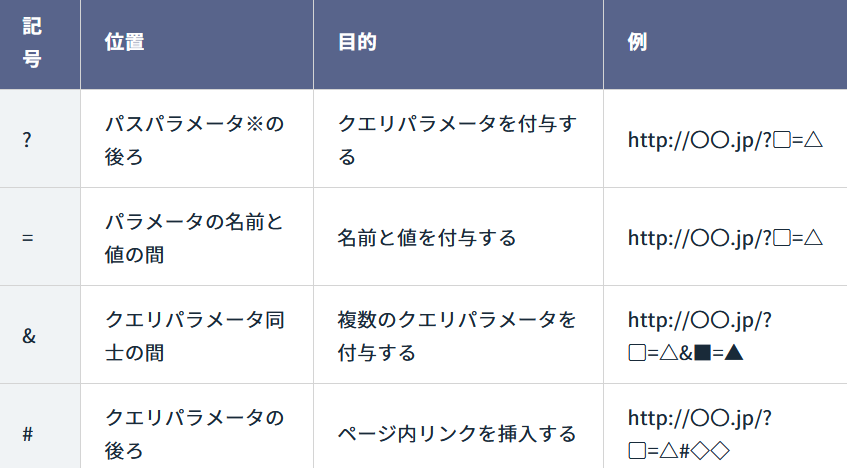

# 第５回課題

## URLとは

**URL**とは、Uniform Resource Locatorの略称で、Webサイトやファイルなどのインターネット上での場所・情報を示すものです。<br>
わかりやすく例えるとインターネット上での**住所**にあたるため、同じURLはインターネットに存在しません。

## URLの構造

URLは以下のような形式で表されます。<br>


### プロトコル

**プロトコル**は、インターネット上で情報をやり取りする際のルールです。例では「https」が相当し、情報が暗号化されて安全に通信されていることを示します。

### スキーム

**スキーム**とは、URLの構造や枠組みを表す要素であり、「https://」が該当します。どのプロトコルでデータのやり取りをするかを示しており、「https://」の場合には「HTTPSで通信すること」を明示しています。

### ホスト名

**ホスト名**とは、ネットワーク上においてコンピューターを識別するためにつけられる名前のことで、通信する際に特定の機器やサーバー（ホスト）を識別するのに使われます。

ホスト名はローカルネットワーク内では一意ですが、インターネット全体では一意である必要はありません。

一般的にホスト名は「World Wide Web」の略である**www**がよく利用されますが、自由に決めることができ省略することも可能です。

### ドメイン

**ドメイン**とは、インターネット上に存在するコンピューターやネットワークを識別するための名前であり、わかりやすくいうと「インターネット上の住所」のことです。

ドメイン名はインターネット全体で一意であり、世界中どこからでもアクセスできるようにDNSに登録されています。

ドメイン名は「.」で区切られた複数の部分から成り立っており、右から左へと読むことで、一般的な住所と同じように広い範囲から狭い範囲へと特定していきます。

* トップレベルドメイン(TLD)<br>
ドメイン名の最も右側にあります。例えば「.com」や「.org」、「.jp」などがこれにあたります。これは、ウェブサイトの種類や国を示すためのものです。

* セカンドレベルドメイン(SLD)<br>
トップレベルドメインのすぐ左に位置します。例えば「example.com」の「example」の部分です。これは、特定の組織や会社を指す名前です。

* サードレベルドメイン（サブドメイン）<br>
セカンドレベルドメインのさらに左にあります。例えば「www.example.com」の「www」の部分です。これは、組織内の特定のサーバーやサービスを指す名前です。

### クエリ文字列(URLパラメーター)

例えば以下のようなURLを考えてみます。
```
https://www.example.com/search?keyA=valueA&keyB=valueB
```

このURLのうち、？以降の部分は**クエリ文字列**(URLパラメータ、クエリストリング)といいま、サーバーに情報を送るためにURLの末尾に付け足す変数のことです。keyの部分にパラメータの名前、valueの部分にパラメータの値が入ります。


クエリパラメータで使う記号と位置は下表のとおりです。



クエリ文字列には２種類あり、それぞれ用途が異なります。

* アクティブパラメーター<br>
アクティブパラメーターを付け加えると、Webサイトの表示内容を変更できます。ブログやECサイトで
<br>特に活用され、ユーザーのニーズに合わせたWebサイトのページ表示を可能にするものです。

&emsp;&emsp;&emsp;例えば、ユニクロのオンラインショップでは、トップページのURLが
```
https://www.uniqlo.com/jp/ja/men
```
&emsp;&emsp;&emsp;となっています。このサイトでは、商品のサイズや色を指定して表示内容を変えることができます。<br>
&emsp;&emsp;&emsp;具体的には、以下のようなURLが生成されます：
```
    サイズをSに限定したページ：https://www.uniqlo.com/jp/ja/men/tops/polo-shirts?sizeCodes=SMA005&categoryId=13929
    サイズをLに限定したページ：https://www.uniqlo.com/jp/ja/men/tops/polo-shirts?sizeCodes=SMA003&categoryId=13929
    色を黒に限定したページ：https://www.uniqlo.com/jp/ja/men/tops/polo-shirts?colorCodes=COL09&categoryId=13929
```
&emsp;&emsp;&emsp;これらのURLでは、クエリパラメーターとしてサイズや色が指定されており、これにより表示する商品を
<br>
&emsp;&emsp;&emsp;フィルタリングしています。アクティブパラメーターの役割は、ユーザーが選択した条件に基づいて、動的に<br>
&emsp;&emsp;&emsp;ページ内容を変更し、最適な情報を提供することにあります。

* パッシブパラメーター<br>
パッシブパラメータとはサーバー上のプログラムの情報収集のために用いられるパラメータのことです。
&emsp;&emsp;URLパラメータの有無にかかわらず、コンテンツの表示内容に影響を与えません。

## パス変数（パスパラメーター）

**パスパラメーター**は、Webアドレス（URL）の一部で、特定のリソースやページにアクセスするために使われる変数です。URLのパスの中で、特定のセクションを動的に指定するために使用されます。例えば以下のURLの/users/12345の部分がパスパラメーターに相当します。

```
http://example.com/users/12345
```

ここで「12345」の部分がユーザーIDなどを表す変数となっています。パスの一部を変数のように扱うことで動的な指定が可能となり、同じURLパターンをもつ多くのリソースに対して、一つのルートを使ってアクセスすることができます。

## パスパラメータとクエリ文字列の違い

位置：パスパラメーターはURLのスラッシュによって区切られたパスの一部です。クエリパラメーターはURLの末尾に<br>
&emsp;&emsp;&emsp;あり、「？」記号の後にキーと値のペアで表されます。

用途：パスパラメーターはリソースを一意に表す必要がある場合に使います。（例：ユーザーID）<br>
&emsp;&emsp;&emsp;クエリパラメーターは、リソースを一意に表す必要がなく、複数パターンが考えられる場合に使用します。
&emsp;&emsp;&ensp;（例：検索条件の指定）

## HTTPプロトコル

### そもそもHTTPとは

**HTTP**はWebブラウザなどのクライアントとWebサーバの間の通信手順や送受信データ形式を規定したプロトコルを指します。原則としてクライアントから要求（リクエスト）を送信し、それに応えてサーバが応答（レスポンス）を返すという手順を繰り返して通信を行います。

### HTTPリクエストメッセージ

HTTPでやり取りする情報のことを**HTTPメッセージ**といいます。HTTPメッセージには、Webブラウザがサーバーに対して処理をお願いする「リクエストメッセージ」と「サーバーがWebブラウザに対して処理結果を返す「レスポンスメッセージ」の２種類があります。

リクエストメッセージは、１行の「リクエストライン」、複数のHTTPヘッダーで構成されている「メッセージヘッダー」、そして「メッセージボディ」の３つで構成されています。このうちリクエストラインは、リクエストの種類を表す「メソッド」、リソースの識別子を表す「リクエストURI」、HTTPのバージョンを表す「HTTPバージョン」の３つで構成されています。

以下はリクエストラインとメッセージヘッダーの例です。

```
> GET /test/request_test.html HTTP/2
> Host: programmer-life.work
> user-agent: curl/7.88.1
> accept: */*
```

リクエストメッセージのメッセージヘッダーは、「リクエストヘッダー」、「一般ヘッダー」、「エンティティヘッダー」、「その他のヘッダー」という４種類のHTTPヘッダーのいずれかで構成されており、どのHTTPヘッダーで構成されるかはWebブラウザによって異なります。

### HTTPリクエストヘッダー

**リクエストヘッダー**は、リクエストメッセージを制御するためのヘッダーです。１９種類のリクエストヘッダーが定義されており、Webブラウザはこの19種類の中からHTTPメッセージの送受信に必要なヘッダーをいくつか選択して、改行コード(\r\n)で区切って複数行で構成しています。

ここでは、主なリクエストヘッダーについて記述します。

#### Acceptヘッダー

**Acceptヘッダー**は、Webブラウザが処理できるファイルの種類とその相対的な優先度をWebサーバーに伝えるために使用されます。<br>
1. WebブラウザはAcceptヘッダーを使用して、処理できるファイルの種類をWebサーバーに伝えます。
1. Webサーバーはその情報をもとに、Webブラウザが処理できるファイルを返します。
1. 対応するファイルがない場合は、Webサーバーは「406 Not Acceptable」を返します。

#### Hostヘッダー

**Hostヘッダー**は、クライアントからサーバーにアクセス先のホスト名とポート番号を通知するために使用されます。「Host: ホスト名:ポート番号」という書式で、「Host: www.example.jp:443」のように指定します。

一つのIPアドレスで複数ドメインを運用する仕組みを「Virtual Host」といいます。この機能を有効にしているWebサーバーは、Hostヘッダーに設定されているFQDNを見て、対象となるVirtual Hostにリクエストを振り分け、それに応じたコンテンツをレスポンスします。

#### Refererヘッダー

**Refererヘッダー**は、直前のリンク元のURLを示すヘッダーです。Webサイトの管理者は、Refererヘッダーの情報をWebサーバーのアクセスログに記録・分析し、マーケティングに活用します。

また、アクセス元に応じて、プログラム側で処理内容や表示するページを切り替えたり、特定のアクセス元からしか処理を受け付けないように制限するなどセキュリティ対策にも有用です。

一方で、リンク元のURLパラメーターに機密情報が付加されている場合、機密情報の漏洩にもつながるので注意が必要です。

#### User-Agentヘッダー

**User-Agentヘッダー」**は、WebブラウザやOSなど、ユーザーの環境を表すヘッダーです。ユーザーがどのWebブラウザのどのバージョンを使用し、どのOSとどのバージョンを使用しているかの情報をもとに、Webサイトのコンテンツをユーザーのアクセス環境に合わせてデザインしなおしたり、内容を最適化したりします。

しかし、User-AgentはWebブラウザの拡張機能で簡単に改変可能なうえ、統一されたフォーマットがなくWebブラウザごとに異なっているため、あくまで参考程度にとどめておく必要があります。

### HTTPレスポンスヘッダー

メッセージヘッダーの中でも、レスポンスメッセージを制御するためのヘッダーを**レスポンスヘッダー**といいます。９種類のレスポンスヘッダーがていぎされており、WebサーバーはHTTPメッセージの返信に必要なヘッダーをいくつか選択して、改行コード(\r\n)で区切って複数行で構成しています。

ここでは、主なレスポンスヘッダーについて記述します。

#### ETag(エンティティタグ)ヘッダー

**ETagヘッダー**は、Webサーバーの持つファイルなどのリソースを一意に識別するためのヘッダーです。

Webサーバはクライアントにリソースを送信する際、HTTPレスポンスヘッダの「ETag:」フィールドにETag値を記載します。ETag値はファイルなどのリソースの特定のバージョンごとに一意であり、同じリソースであっても更新・修正が行われ内容が変化すると新しい値に更新されます。

ETagの特徴を生かして、キャッシュの制御を行うことができます。
1. キャッシュを作成する際にサーバから添付されたETagも一緒に保存します。
1. 次にリソースが呼び出された際、クライアントはサーバに同じリソースを再度要求そします。その際、HTTPリクエストヘッダに「If-None-Match:」フィールドなどを用いて前回取得したETagを記載します。
1. サーバ側は送られてきたETagを現在のものと比較し、更新されていればリソースを再送信、されていなければ「304 Not Modified」応答のみを送信してキャッシュの内容を利用するよう指示します。

#### Locationヘッダー

**Locationヘッダー**は、リダイレクト先を通知するために使用するヘッダーです。リダイレクトを表す３００番台のステータスコードとあわせて使用します。Locationヘッダーには、リダイレクト先のURLが設定されます。ほとんどのWebブラウザは、Locationヘッダーを含むレスポンスを受け取ると、自動的にLocationヘッダーが示すリダイレクト先へとアクセスするようになっています。

#### Serverヘッダー

**Serverヘッダー**は、Webサーバーの情報がセットされるヘッダーです。具体的には、WebサーバーのOSやそのバージョン、ソフトウェアやそのバージョンなどが設定されます。Serverヘッダーは、サーバーの情報をそのまま世の中にさらすことになり、セキュリティ上の問題があるため、Webサーバーの設定でServerヘッダーを無効にしておきます。

### HTTPレスポンスボディ

サーバーからの応答メッセージであるHTTPレスポンスの後半部分が、クライアントへ送信するファイルなどのデータ本体あるボディ部(**HTTPレスポンスボディ**)です。

レスポンスボディはJSON形式で表現され、オブジェクトと配列から構成されます。

### HTTPメソッド

**HTTPメソッド**は、クライアントがサーバーに対してお願いするリクエストの種類を表しています。HTTPメソッドは８種類あり、それぞれ「OPTIONS」、「GET」、「HEAD」、「POST」、「PUT」、「DELETE」、「TRACE」、「CONNECT」です。

* GETメソッド：ファイルなど指定されたリソースをサーバーに送信するよう要求する際に使用されます。<br>
&emsp;&emsp;&emsp;&emsp;&emsp;&ensp;例えば、Webページや画像などをブラウザで表示する際にGETリクエストが使われます。

* POSTメソッド：クライアントからフォームの入力内容など指定されたリソースを送信し、サーバーに受信<br>
&emsp;&emsp;&emsp;&emsp;&emsp;&emsp;するよう要求します。例えば、フォームの送信やファイルのアップロードに使われます。

* PUTメソッド：指定されたリソースに対してデータをアップロードする際に使用されます。POSTメソッドと<br>
&emsp;&emsp;&emsp;&emsp;&emsp;&ensp;異なり、送信されたデータでリソースの内容を完全に置き換えます。例えば、ファイルや<br>
&emsp;&emsp;&emsp;&emsp;&emsp;&ensp;データベースのレコードを更新する際にPUTが使われることがあります。

* PATCHメソッド：リソースの一部を部分的に更新するために使用されます。PUTメソッドとは異なり、<br>
&emsp;&emsp;&emsp;&emsp;&emsp;&emsp;&ensp;リソース全体を置き換えるのではなく、変更が必要な部分だけを送信します。これに<br>
&emsp;&emsp;&emsp;&emsp;&emsp;&emsp;&ensp;より、ネットワークを介して送信するデータ量を減らすことができます。

* DELETEメソッド：指定されたリソースを削除するために使用されます。例えば、データベースから特定の<br>
&emsp;&emsp;&emsp;&emsp;&emsp;&emsp;&emsp;レコードを削除する際に使用されます。

### HTTPステータスコード

**HTTPステータスコード**は、クライアントとサーバー間の通信結果を示す３桁の数字で、５つのクラスに分けられます。代表的なステータスコードを以下に示します。

#### 1xx(情報レスポンス)

処理中の情報をクライアントに伝えるためのコードです。

| ステータスコード | 説明 |
| :--- | :--- |
| 100　Continue | リクエスト継続可能 |
| 101　Switching Protocols | クライアントがアップグレードヘッダーで要求したプロトコルに切り替える |

#### 2xx(成功)

クライアントからのリクエストが正常に受付されたことを示すコードです。

| ステータスコード | 説明 |
| :--- | :--- |
| 200　OK | リクエストが成功 |
| 201　Created | リクエストが成功し、新しいリソースが作成された |
| 202　Accepted | リクエストは受付されたが、処理は完了していない |
| 204　No Content | リクエストは成功したが、コンテンツは返さない |

#### 3xx(リダイレクション)

「リダイレクト」が発生した際に表示されるコードです。

| ステータスコード | 説明 |
| :--- | :--- |
| 301　Moved Permanently | リソースが恒久的に新しいURLに移動した |
| 302　Found | リソースが一時的に別のURLに移動した |
| 303　See Other | リクエストに対する応答が他のURLで見つかる |
| 304　Not Modified | 更新されていない（リソースは変更されていないので、<br>キャッシュされたバージョンを使用できる） |

#### 4xx(クライアントエラー)

リクエストにエラーがあるか、完了できないことを示すコードです。

| ステータスコード | 説明 |
| :--- | :--- |
| 400　Bad Request | リクエストが不正である |
| 401　Unauthorized | 認証が必要である |
| 403　Forbidden | サーバーがリクエストを拒否している |
| 404　Not Found | リクエストされたリソースが見つからない |

#### 5xx(サーバーエラー)

Webサーバーがリクエストの処理に失敗したことを示すコードです。

| ステータスコード | 説明 |
| :--- | :--- |
| 500　Internal Server Error | サーバー内部にエラーが発生した |
| 501　Not Implemented | サーバーがリクエストメソッドをサポートしていない |
| 502　Bad Gateway | ゲートウェイ・プロキシサーバが不正なリクエストを受け取り拒否した |
| 503　Service Unavailable | サーバーが一時的にリクエストを処理できない、メンテナンス中など |
| 504　Gateway Timeout | ゲートウェイタイムアウト、サーバからレスポンスがなくタイムアウトした |

## JSON

**JSON**(avaScript Object Notation)は、入力された任意の言語のデータ構造を他の言語やプラットフォームで認識できる形式に変換できるデータ形式です。JSONは、人間が読めるテキストであり、軽量でコーディングが少なくて済み、処理が高速であるという特徴があります。

JSONは次のデータ型で構成されます。

* 配列
* bool
* null
* 数値
* オブジェクト
* 文字列

このうち、主なデータ型であるbool型、null型、数値型、文字列型について記述します。

### bool型

boolとは真（true）か偽（false）いずれかの値をとるデータ型のことです。日本語で「論理型」といいます。

例：
```
{“Attendance” : true}
```

### null型

nullとは「何もない」という意味です。項目として用意されているものの、該当する値がない時に以下のように使用します。

例：
```
{“Number” : 2, “Prefecture” : “Aichi”, “Capital” : “Nagoya”, “Famous Attraction” : null},
```

### 数値型

数値はダブルクォーテーションで囲わずに記述します。

例：
```
{“Number” : 1}
```

### 文字列型

文字列はダブルクォーテーションで囲んで記述します。数値をダブルクォーテーションで囲うと文字列型として扱われるので注意が必要です。

例：
```
{“Prefecture” : “Hyogo”}

{“Prefecture” : “埼玉”, “Capital” : “さいたま”},
```

## JSONの例

JSONでiPhone14の商品情報を記述すると以下のようになります。

```
{
  "product": {
    "id": "IP14-256-BLK",
    "name": "iPhone 14",
    "model": "iPhone 14",
    "description": "最新のA15 Bionicチップを搭載したiPhone14は、優れたパフォーマンスと長いバッテリー寿命を提供します。",
    "storageOptions": [
      {"capacity": "128GB", "price": 98000},
      {"capacity": "256GB", "price": 110000},
      {"capacity": "512GB", "price": 130000}
    ],
    "colors": ["ブラック", "ホワイト", "レッド", "ブルー", "グリーン"],
    "price": 110000,
    "currency": "JPY",
    "inStock": true,
    "features": {
      "display": "6.1インチ Super Retina XDRディスプレイ",
      "chip": "A15 Bionicチップ",
      "camera": {
        "main": "デュアル 12MP カメラシステム",
        "front": "12MP TrueDepthカメラ"
      },
      "batteryLife": "最大17時間のビデオ再生",
      "waterResistance": "IP68防水防塵仕様"
    },
    "dimensions": {
      "height": "146.7mm",
      "width": "71.5mm",
      "depth": "7.65mm",
      "weight": "172g"
    },
    "releaseDate": "2022-09-24"
  }
}
```

## 参考サイト
[URLとは何か正しく理解していますか？](https://innova-jp.com/what-is-url/)
<br>

[ドメインとは？をわかりやすく解説します](https://www.kagoya.jp/howto/it-glossary/domain/web-01/)

[クエリパラメーターとは？URLの基本的な設定方法やコツを解説](https://be-marke.jp/articles/knowhow-queryparameter)

[URLパラメータとは？書き方の基礎知識や注意点を解説](https://www.willgate.co.jp/promonista/url-parameter/)

[クエリ文字列(URLパラメーター)とは？Webサービス上の用途とその役割](https://online.dhw.co.jp/kuritama/query-string/)

[APIでパスパラメータとは？パスパラメータの使い方を解説](https://apidog.com/jp/blog/how-to-use-path-parameters/)

[REST API設計時に気を付ける主なポイント](https://omathin.com/swagger-editor-design-firststep/)

[HTTPリクエストヘッダ](https://e-words.jp/w/HTTP%E3%83%AA%E3%82%AF%E3%82%A8%E3%82%B9%E3%83%88%E3%83%98%E3%83%83%E3%83%80.html)

[Hostヘッダ](https://e-words.jp/w/Host%E3%83%98%E3%83%83%E3%83%80.html)

[リファラーとは](https://blog.senseshare.jp/referrer.html)

[HTTPメソッドとRESTのおさらい](https://www.ipride.co.jp/blog/2201)

[HTTPリクエストメソッド](https://e-words.jp/w/HTTP%E3%83%AA%E3%82%AF%E3%82%A8%E3%82%B9%E3%83%88%E3%83%A1%E3%82%BD%E3%83%83%E3%83%89.html)

『図解入門TCP/IP』&emsp;みやた ひろし著&emsp;2020&emsp;P284～293

[HTTPステータスコード一覧と
リクエストとレスポンスの意味を解説](https://www.itmanage.co.jp/column/http-www-request-response-statuscode/)

[HTTPステータスコードとは？コード番号別に詳しく解説](https://www.seohacks.net/blog/1147/)

[JSONの構造と構文 ](https://help.mabl.com/hc/ja/articles/19078205331348-JSON%E3%81%AE%E6%A7%8B%E9%80%A0%E3%81%A8%E6%A7%8B%E6%96%87)

[JSONの定義](https://www.oracle.com/jp/database/what-is-json/)
